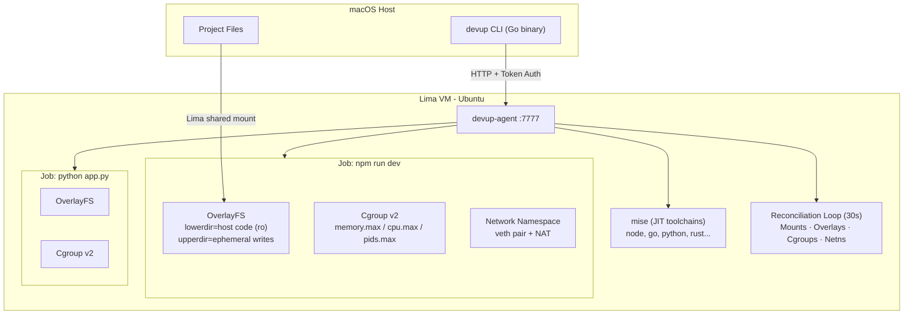

# Arrears

**A container memory scheduler that remembers what it did.**

Every container scheduler running today treats each reclaim decision as independent. Kubernetes doesn't know it evicted from your checkout service 20 minutes ago. Neither does cgroup's PSI controller. Neither does TMO. They look at current pressure, make a decision, and forget it happened.

Arrears doesn't forget.

---

## The problem

You're running eight containers on a host. A ninth arrives and needs 400MB. Your scheduler looks at current memory pressure and picks who to reclaim from. It picks the batch analytics job — sensible, it has the most recoverable pages.

Two hours later, another job arrives. The batch job has rebuilt about 60% of its working set. Your scheduler looks at current pressure again. The batch job still has more recoverable pages than anyone else. It reclaims from the batch job again.

This is wrong. You interrupted a recovery that was in progress. The actual cost of reclaiming from the batch job right now is higher than it was two hours ago — but no scheduler can tell you that, because no scheduler tracked what happened two hours ago.

Now imagine this happening to your checkout service instead of your batch job. Or your auth service. This is why latency spikes are hard to debug: the cause happened 20 minutes before the symptom, and the scheduler has no memory of it.

---

## What Arrears does differently

Three things, in order of novelty:

**1. SLO-derived distortion weights.**
Each container receives a weight $\alpha_i$ computed directly from its SLO spec:

$$\alpha_i = \frac{1}{(1 - \text{CVaR level}) \cdot \text{CVaR budget}^2}$$

No priority tiers. No manual configuration. A checkout service with 70ms of SLO headroom gets a weight 950× higher than a batch analytics job with 1200ms of headroom — derived entirely from those numbers. The scheduler protects containers in proportion to how much damage reclaiming from them actually causes.

**2. S/R/H memory decomposition.**
Every container's memory is split into three zones by reading `/proc/<pid>/smaps`:

- **Shared** (S): file-backed, already deduplicated across containers
- **Recoverable** (R): cold anonymous pages, safe to evict
- **Hot core** (H): recently referenced working set, never touched

The optimizer only reclaims from R. H is protected by a hard floor at 1.1×H. The scheduler knows the difference between 1200MB RSS on an ML inference container (732MB hot core, 16% reducible) and 1200MB RSS on a batch job (216MB hot core, 58% reducible).

**3. Temporal reclaim debt.**
Each container carries a debt signal $\Phi_i(t)$ that accumulates when it's reclaimed from and decays according to a power-law kernel derived from Zipf-distributed page access:

$$\Phi_i(t) = \sum_k e_k \cdot \left(1 + \frac{\lambda_i(t - t_k)}{N_i}\right)^{-\alpha_i}$$

where $N_i$ is the container's VMA count, $\alpha_i$ is its Zipf exponent, and $\lambda_i$ is its current request rate — all readable from existing kernel interfaces.

When the scheduler is about to reclaim from a container, it multiplies the marginal cost by $(1 + \kappa \cdot \Phi_i/H_i)$. A container still in recovery costs more to reclaim from again. The scheduler routes pressure elsewhere until the debt decays.

---

## The number that matters

Two containers. Both running 1200MB RSS on the same host.

| | Container A (batch) | Container B (checkout) |
|---|---|---|
| Baseline p95 latency | 800ms | 80ms |
| SLO threshold | 2000ms | 150ms |
| SLO headroom | 1200ms | 70ms |
| Weight $\alpha_i$ | $6.2 \times 10^{-6}$ | $5.9 \times 10^{-3}$ |

The marginal cost of reclaiming 1MB from B is **950× higher** than from A. The scheduler exhausts A's recoverable pages before touching B. No priority class, no annotation, no config — just the SLO numbers.

---

## Current status

| Component | Status |
|---|---|
| `internal/pressure` — PSI reader | Designed, not yet implemented |
| `internal/workload` — S/R/H decomposition | Designed, not yet implemented |
| `internal/distortion` — CVaR weight derivation | Designed, not yet implemented |
| `internal/optimizer` — greedy marginal-cost scheduler | Designed, not yet implemented |
| `internal/optimizer/debt` — power-law debt tracker | Designed, not yet implemented |
| Theory and math | Complete |
| Test suite design | Complete (32 table-driven tests specified) |

This is pre-implementation. The theory is solid, the interfaces are designed, the math has been checked. Implementation is the next step.

---

## What I need from you

If you run containers in production — Kubernetes, bare metal, or anything in between — I have five specific questions:

1. **Does the S/R/H decomposition match reality?** When you look at your workloads with `smaps`, does the hot/recoverable split behave the way the model predicts? ML inference and in-memory databases should be ~60-70% hot core. Batch and build workloads should be ~60-70% recoverable. Does that match what you see?

2. **Have you been burned by the reclaim-then-reclaim pathology?** A container gets reclaimed from, starts rebuilding, gets reclaimed from again before it finishes. The symptom is intermittent latency spikes with no obvious cause in current-state metrics. Is this a real pain point in your environment?

3. **Is the SLO spec interface realistic?** Arrears requires each container to declare `LatencyBaselineMs`, `LatencyThresholdMs`, and `CVaRLevel` at launch. Is this information you have? Is it something you'd be willing to configure?

4. **What's the hardest assumption to validate in your environment?** The Zipf access distribution for the power-law debt model, the S/R/H decomposition validity, the CVaR latency model — which of these is most likely to break on your actual workloads?

5. **Would you run this in staging?** Not asking for production commitment. But if there were a working prototype, is this a problem worth spending engineering time on?

Open an issue, send a PR with feedback on the design docs, or reach out directly. All of it is useful.

---

## Theory and math

The complete theoretical foundation — S/R/H decomposition, CVaR weight derivation, distortion objective, temporal debt model, lower bound propositions, and simulation results — is in [`docs/theory.md`](docs/theory.md).

---

## Why not TMO, Kubernetes QoS, or Koordinator?

**TMO (Meta, ASPLOS 2022)** is a single-container control loop. It answers: how much should I offload from *this* container? It has no cross-container reclaim planning and no SLO-derived weights. Its pressure threshold is statically calibrated per workload class.

**Kubernetes QoS** has three tiers: Guaranteed, Burstable, BestEffort. Priorities are user-assigned, not computed from latency structure. There is no distortion model and no reclaim history.

**Alibaba Koordinator** implements hybrid colocation with memory QoS tiers. Heuristic priority classes, not a formal distortion objective. No temporal debt.

None of them track reclaim history. None of them derive protection weights from SLO tail risk. None of them plan cross-container reclaim as a joint optimization.


## Architecture



## Quickstart

```bash
brew install lima
go install devup/cmd/devup@latest

devup vm up                    # Start VM + agent (~5s)
devup run -- echo hello        # Run a command
devup dev -f                   # Start Node.js dev server (from project root)
devup start -- python3 app.py  # Background job
devup ps                       # List jobs
devup stop                     # Stop last job
```

## Isolation Primitives

### OverlayFS (Filesystem Sandboxing)

Every job can run with `--overlay` to get a copy-on-write view of your project files. The host code becomes a read-only lower layer; all writes land in an ephemeral upper directory that is destroyed when the job ends. Your Mac's files are never modified.

```bash
devup run --overlay -- npm install    # writes stay in VM, host untouched
devup run --overlay -- rm -rf /       # can't damage host filesystem
```

### Cgroups v2 (Resource Limits)

Pin memory, CPU, and process count per job. Raw writes to `/sys/fs/cgroup/devup/<jobID>/`.

```bash
devup start --memory 512 --cpu 50 --pids 100 -- npm run dev
```

### Network Namespaces (Network Isolation)

Each job can get its own network stack via `--net-isolate`. A veth pair bridges the job's private namespace to the VM, with NAT for internet access. No port collisions between jobs.

```bash
devup start --net-isolate -- python3 -m http.server 8000
devup start --net-isolate -- python3 -m http.server 8000  # same port, different namespace
```

### Combined Isolation

`--isolate` enables OverlayFS + network namespace together — a full sandbox.

```bash
devup start --isolate --memory 256 -- untrusted-script.sh
```

## JIT Toolchain Provisioning

DevUp auto-detects your project's language from marker files and installs the right runtime via [mise](https://mise.jdx.dev/) on first run:

| File | Tool installed |
|---|---|
| `package.json` | node (version from `engines.node` or LTS) |
| `go.mod` | go (version from `go` directive) |
| `requirements.txt` / `pyproject.toml` | python |
| `Cargo.toml` | rust |
| `Gemfile` | ruby |
| `.mise.toml` / `.tool-versions` | Defers to mise native config |

Toolchains are cached in `/opt/devup/mise` and shared across jobs.

## Self-Healing Reconciliation

The agent runs a unified garbage collector every 30 seconds that reconciles four types of kernel objects:

1. **Bind mounts** — scans `/proc/mounts` for orphaned `/workspace` entries
2. **OverlayFS** — prunes `/var/lib/devup/overlay/` dirs without active jobs
3. **Cgroups** — removes `/sys/fs/cgroup/devup/` entries for dead jobs
4. **Network namespaces** — deletes `devup-*` namespaces via `ip netns`

If the agent crashes, every leaked kernel object is cleaned up on restart. The golden rule: **if it doesn't clean up after itself, it's malware.**

## TUI Dashboard

```bash
devup dashboard   # or: devup ui
```

Interactive terminal UI for VM status, job management, log streaming.

| Key | Action |
|---|---|
| `r` | Refresh |
| `enter` | View logs |
| `s` | Stop selected job |
| `a` | Start new job |
| `d` | Stop all jobs |
| `f` | Toggle log follow |
| `q` | Quit |

## CLI Reference

| Command | Description |
|---|---|
| `devup vm up` | Start Lima VM and agent |
| `devup vm down` | Stop VM |
| `devup vm shell` | Open shell in VM |
| `devup vm status` | VM and agent status |
| `devup vm provision` | Install base toolchains |
| `devup vm doctor` | Check toolchain versions |
| `devup run [opts] -- <cmd>` | Run command (ephemeral) |
| `devup start [opts] -- <cmd>` | Start background job |
| `devup ps` | List jobs with limits |
| `devup logs [id] [-f]` | Job logs |
| `devup stop [id]` | Stop job |
| `devup down` | Stop all jobs |
| `devup dashboard` | TUI (alias: `ui`) |
| `devup dev [-f]` | Start Node.js dev server |

**Run/Start flags:** `--mount`, `--workdir`, `--memory`, `--cpu`, `--pids`, `--overlay`, `--net-isolate`, `--isolate`

## How It Works

1. **Lima VM** — Lightweight Ubuntu VM on macOS with shared filesystem via virtio-9p
2. **devup-agent** — Go HTTP server inside the VM (port 7777, token auth) that manages jobs
3. **Process groups** — Every job runs with `Setpgid: true` so `SIGTERM`/`SIGKILL` reliably kills the entire tree
4. **OverlayFS** — `mount -t overlay` with lowerdir (host code) + upperdir (ephemeral) + merged (what the process sees)
5. **Cgroups v2** — Direct writes to `/sys/fs/cgroup/devup/<jobID>/memory.max`, `cpu.max`, `pids.max`
6. **Network namespaces** — `ip netns add` + veth pair + iptables NAT for per-job network isolation
7. **mise** — JIT toolchain provisioning; detects language from workspace files, installs correct runtime
8. **Reconciliation loop** — 30s GC that diffs kernel state against the jobs map and cleans up orphans

## Project Structure

```
cmd/devup/          Host CLI (macOS)
cmd/devup-agent/    Agent (Linux VM)
internal/
  api/              Request/response types
  cgroup/           Cgroups v2 raw filesystem ops
  client/           HTTP client for agent
  config/           Token and config management
  logging/          Structured logging
  mounts/           Mount flag parsing
  netns/            Network namespace lifecycle
  overlay/          OverlayFS mount/unmount/reconcile
  ringbuffer/       In-memory log buffer
  toolchain/        Language detection + mise integration
  tui/              Bubble Tea dashboard
  util/             Shared utilities
  vm/               Lima VM lifecycle
scripts/
  vm-provision.sh   Base toolchain provisioning (embedded via go:embed)
vm/lima/
  devup.yaml        Lima VM configuration
```

## License

MIT
